# skill-flow-viz 索引

> 核心 Skill 执行流程可视化目录。把 `SKILL.md` 里的机器指令翻译为流程图 + 时间轴 + 信息卡，让人无需通读源码即可掌握每个 Skill 的执行脉络。
> 最后更新：2026-08-15

## 一、用途声明

本目录收录 20 个核心 Skill 的**单页可视化 HTML**，覆盖九大研发层次 + 业务层 + 外部开源层（共 11 大类）。每份 HTML 是"导览解说版"——呈现流程骨架、触发边界、治理指标、关联 Skill，而非工程全部细节（完整源码在 `skills/<name>/` 下）。

- **入口文件**：`index.html` — 十一大类全量目录总览（九大研发层次卡片 + 业务层/外部开源层登记），点击卡片跳转各 Skill 单页；并含「全生命周期主链」从元工程到价值输出逐环可视化
- **共享资源**：`assets/style.css`（页面样式）+ `assets/flow.css`（流程图样式）+ `assets/panzoom.min.js`（画板缩放/拖拽）
- **生成工具**：`skills/skill-flow-viz-generator/` — 脚本一键生成，确保全站风格一致
- **合规审计**：`compliance-audit.md` — 页面内容产权与归因合规审计记录（配合 `skills/ip-compliance-scanner/`）

## 二、快速路由表（路）

> 按你想看什么来定位。每份 HTML 的"一句话"遮住标题也能判断用途。

| 我想了解 / 我想找 | 主文件 | 辅助文件 |
|---|---|---|
| **总览全部 Skill**、按层次浏览、全生命周期主链 | `index.html` | `compliance-audit.md` |
| **页面合规审计**、内容归因、产权检查结论 | `compliance-audit.md` | `index.html` |
| **Skill 工程怎么创建**、五大惯例、质检标准 | `project-skill-builder.html` | `feature-distiller.html` |
| **框架开发契约怎么抽取**、三级约束（🔴🟡⚫） | `feature-distiller.html` | `project-skill-builder.html` |
| **多 Agent 并行开发**、UEP 协议、任务锁定 | `UEP.html` | `meta-agent-collaboration.html` |
| **串行全栈脚手架**、人工门控、断点续传 | `ai-dev-workflow.html` | `UEP.html` |
| **功能开发方法论**、7 阶段 Loop、防幻觉机械臂 | `meta-feature-dev.html` | `meta-agent-collaboration.html` |
| **多 Agent 怎么协作**、需求两级门控、三层认知模型 | `meta-agent-collaboration.html` | `meta-feature-dev.html` |
| **产品 PRD 基座**、三层文档产出、交互式需求分析 | `ai-project-prompt.html` | `meta-feature-dev.html` |
| **AI 自我进化**、从会话历史学习、个人 playbook | `meta-self-iteration.html` | `doc-troubleshooting.html` |
| **持久化项目管理**、三文件模式、STATUS 追踪 | `planning-with-files-zh.html` | `ai-dev-workflow.html` |
| **微服务接口全量测试**、venv 隔离、致命即停 | `test-microservice-python.html` | `api-test-harness.html` |
| **接口防幻觉测试**、grep 提取参数 + curl 验证 | `api-test-harness.html` | `test-microservice-python.html` |
| **不知道怎么排查报错**、通用排障入口、自动分类 | `debug-problem.html` | `debug-backend-500.html` |
| **后端 500 错误**、Docker + Java、5 阶段 SOP | `debug-backend-500.html` | `debug-problem.html` |
| **前端 404 错误**、三层链路追踪、proxy 错配判定 | `debug-frontend-404.html` | `debug-problem.html` |
| **前端参数异常**、标准排查文档生成 | `debug-frontend-param.html` | `debug-frontend-404.html` |
| **复盘归档**、13 章复盘文档、Mermaid 流程图 | `doc-troubleshooting.html` | `debug-problem.html` |
| **Docker 容器化规范**、6 大原则、国产镜像源 | `docker-container-design.html` | `rag-context-engine.html` |
| **RAG 上下文工程**、Write/Select/Compress/Isolate | `rag-context-engine.html` | `docker-container-design.html` |
| **AI 数字员工平台**、五层架构、行业合规 | `ai-digital-employee.html` | `meta-agent-collaboration.html` |
| **项目价值提取**、7 机械臂、面试特训包 | `project-cv-generator.html` | — |

## 三、依赖关系图（串）

> 每份 HTML 独立可读——不需要先看 A 才能看懂 B。但按层次分组阅读体验更好。

```mermaid
graph TB
    Index[index.html 全量总览+主链] -->|点击进入| PSB[project-skill-builder]
    Index -->|点击进入| FD[feature-distiller]
    Index -->|点击进入| UEP[UEP]
    Index -->|点击进入| AW[ai-dev-workflow]
    Index -->|点击进入| MFD[meta-feature-dev]
    Index -->|点击进入| MAC[meta-agent-collaboration]
    Index -->|点击进入| APP[ai-project-prompt]
    Index -->|点击进入| MSI[meta-self-iteration]
    Index -->|点击进入| PF[planning-with-files-zh]
    Index -->|点击进入| TMP[test-microservice-python]
    Index -->|点击进入| ATH[api-test-harness]
    Index -->|点击进入| DP[debug-problem]
    Index -->|点击进入| DB5[debug-backend-500]
    Index -->|点击进入| DF4[debug-frontend-404]
    Index -->|点击进入| DFP[debug-frontend-param]
    Index -->|点击进入| DT[doc-troubleshooting]
    Index -->|点击进入| DCD[docker-container-design]
    Index -->|点击进入| RCE[rag-context-engine]
    Index -->|点击进入| ADE[ai-digital-employee]
    Index -->|点击进入| PCG[project-cv-generator]
    Index -.->|合规复检| CA[compliance-audit.md]
```



```
入口层
  └── index.html（先读）— 十一大类全量总览 + 全生命周期主链，了解全局布局

层次阅读（按需跳转，无强制先后）
  ├── 元工程层        project-skill-builder  →  feature-distiller
  ├── 工程协议层      UEP  +  ai-dev-workflow（可并行）
  ├── 元方法论层      ai-project-prompt  +  meta-feature-dev  →  meta-agent-collaboration
  │                   meta-self-iteration（独立）
  ├── 工程过程层      planning-with-files-zh  +  test-microservice-python  +  api-test-harness（可并行）
  ├── 排障修复层      debug-problem  →  debug-backend-500 / debug-frontend-404  →  debug-frontend-param
  │                   doc-troubleshooting（复盘归档，排障后使用）
  ├── 安全扫描层      待生成单页（index.html 目录登记：local-path-scanner / secret-leak-check / ip-compliance-scanner / compliance-developer-assistant）
  ├── 基础设施层      docker-container-design  +  rag-context-engine（可并行）
  ├── 源码分析层      待生成单页（index.html 目录登记：doc-frontend-routes / doc-agent-modules / doc-config-flags / doc-data-models）
  ├── 行业方案层      ai-digital-employee  +  project-cv-generator（可并行）+ reporting-art（目录登记，双栖业务层）
  ├── 业务层          目录登记（无单页）：rag-pipeline-builder / frontend-design / ui-ux-pro-max / video-generator / python-package-install / orca-cli / orchestration / computer-use / khazix-skills-main / mattpocock-skills（套件）
  └── 外部开源层      目录登记（无单页，9 张索引卡，需 clone 上游仓库）

待生成可视化的层次
  ├── 安全扫描层      local-path-scanner / secret-leak-check / ip-compliance-scanner / compliance-developer-assistant（index.html 有登记卡，单页待生成）
  └── 源码分析层      doc-frontend-routes / doc-agent-modules / doc-config-flags / doc-data-models（index.html 有登记卡，单页待生成）
```

## 四、文档详情

### 入口文件（1 个）

| # | 文件 | 一句话 | 读者 | 前置依赖 |
|---|------|--------|------|---------|
| 1 | `index.html` | 十一大类全量目录 + 全生命周期主链总览：九大研发层次卡片 + 业务层/外部开源层登记 + 价值总览主链 | 所有人 | 无 |

### 合规审计（1 个）

| # | 文件 | 一句话 | 读者 | 前置依赖 |
|---|------|--------|------|---------|
| 2 | `compliance-audit.md` | 页面内容产权/归因合规审计记录：扫描结论、独立创作判读、词库沉降、复扫闭环 | 页面维护者 | `skills/ip-compliance-scanner/` |

### 可视化单页（20 个，按层次分组）

| # | HTML | 一句话 | 适用场景 | 所属层 |
|:--:|------|--------|---------|--------|
| 1 | `project-skill-builder.html` | Skill 工程五大惯例：目录布局/产出隔离/SKILL.md 规范/质检闭环 | 创建新 Skill 前了解规范 | 元工程层 |
| 2 | `feature-distiller.html` | V2 框架契约抽取：双模式 + 全维度语义扫描 + 🔴🟡⚫三级约束 | 接手框架项目需要统一开发规范 | 元工程层 |
| 3 | `UEP.html` | 多 Agent 并行协议：5 步 Workflow + STATE.json + 不可变日志（已归档） | 大型功能需要多人协作开发 | 工程协议层 |
| 4 | `ai-dev-workflow.html` | 串行全栈脚手架：7 步流程 + 人工确认门控 + 断点续传 | 需要人类逐步把关的全栈项目 | 工程协议层 |
| 5 | `meta-feature-dev.html` | 功能开发元方法论：7 阶 Loop + 5 机械臂防幻觉 | 让 AI 按方法论做功能开发 | 元方法论层 |
| 6 | `meta-agent-collaboration.html` | 需求两级质量门控 + 三层认知模型 + 反推验证 | 多 Agent 协作前对齐需求理解 | 元方法论层 |
| 7 | `ai-project-prompt.html` | 产品 PRD 基座：三个产品意识大脑 + 七步交互 SOP | 从零做产品需要结构化 PRD | 元方法论层 |
| 8 | `meta-self-iteration.html` | AI 自我进化：3 阶段 Loop + Maker/Checker + 增量 checkpoint | 月度复盘、跨项目经验迁移 | 元方法论层 |
| 9 | `planning-with-files-zh.html` | 三文件持久化规划 + 自动维护 STATUS/CHANGELOG | 多步骤任务需要持久化状态 | 工程过程层 |
| 10 | `test-microservice-python.html` | 微服务全量接口测试：venv 隔离 + 致命错误即停 | Python 微服务回归测试 | 工程过程层 |
| 11 | `api-test-harness.html` | 接口机械臂测试：四道防幻觉红线 + curl 双产出 | 需要防幻觉的 API 快速验证 | 工程过程层 |
| 12 | `debug-problem.html` | 通用排障入口：自动分类 + 假设驱动逐步验证 | 不知道从哪开始排查 | 排障修复层 |
| 13 | `debug-backend-500.html` | Java + Docker 后端 500 专项：5 阶段 SOP | Java 微服务 500 错误 | 排障修复层 |
| 14 | `debug-frontend-404.html` | 前端 404 三层链路追踪：网关/proxy/Controller | 微服务架构前端 404 | 排障修复层 |
| 15 | `debug-frontend-param.html` | 前端参数排查：生成标准排查文档给 Agent 执行 | 请求参数异常 | 排障修复层 |
| 16 | `doc-troubleshooting.html` | 13 章复盘文档 + 多假设分析 + Mermaid 流程图 | 问题解决后复盘归档 | 排障修复层 |
| 17 | `docker-container-design.html` | 6 大原则容器化 + 国产镜像源 + 离线部署 | 需要容器化的任何项目 | 基础设施层 |
| 18 | `rag-context-engine.html` | RAG 上下文工程：四策略 + Token 预算 + 三层记忆（双栖：业务层） | AI 应用上下文管理 | 基础设施层 |
| 19 | `ai-digital-employee.html` | AI 数字员工平台：五层架构 + 多智能体编排 + 四大行业（已归档） | 企业级 AI 平台产品设计 | 行业方案层 |
| 20 | `project-cv-generator.html` | 项目价值提取：7 机械臂 + 7 段式简历 + 面试特训包 | 项目结束后提炼价值 | 行业方案层 |

### 共享资源（4 个）

| # | 文件 | 一句话 |
|---|------|--------|
| 1 | `assets/style.css` | 共享页面样式（浅/深色自适应，IBM Plex Sans + JetBrains Mono） |
| 2 | `assets/flow.css` | 流程图样式（fh-flow 节点/箭头/门控/新功能标记） |
| 3 | `assets/panzoom.min.js` | 画板缩放/拖拽库——所有流程图页面共用 |
| 4 | `assets/mermaid.min.js` | Mermaid 图表库（v1.0 遗留，v2.0 起统一用 fh-flow，新页面禁止引入） |

## 五、场景执行路径（景）

### 场景 1：快速了解某个 Skill 做什么

```
index.html（先读）→ 找到目标层次的卡片 → 点击跳转 <skill>.html（完整读）
```

### 场景 2：对比串行 vs 并行开发引擎

```
UEP.html + ai-dev-workflow.html（并行读）→ 按团队规模选择
```

### 场景 3：排障一条龙（从报错到复盘）

```
debug-problem.html（先读）→ debug-backend-500.html 或 debug-frontend-404.html（后读）
  → debug-frontend-param.html（选读，如果是参数问题）
  → doc-troubleshooting.html（后读，复盘归档）
```

### 场景 4：新建 Skill 工程前的准备工作

```
project-skill-builder.html（必读）→ feature-distiller.html（选读，框架类 Skill）
  → index.html（引用，了解现有 Skill 布局避免重复）
```

### 场景 5：搭建多 Agent 协作体系

```
meta-agent-collaboration.html（先读）→ UEP.html（必读）→ ai-dev-workflow.html（选读）
  → meta-feature-dev.html（引用）
```

### 场景 6：为新 Skill 生成可视化 HTML

```
index.html（先读）→ 确认目标 Skill 尚无 HTML
  → 用 skill-flow-viz-generator 生成 → 在 index.html 登记
```

### 场景 7：页面内容合规审计

```
index.html（先读）→ skills/ip-compliance-scanner/（跑机械臂 + AI 判读）
  → compliance-audit.md（更新审计记录，词库沉降）→ 复扫闭环
```

## 六、跨文档一致性规则（盾）

| 规则 | 优先级 | 涉及文件 | 裁决 |
|------|--------|---------|------|
| HTML 流程必须忠于 SKILL.md | 🔴 强制 | `<skill>.html` ↔ `skills/<skill>/SKILL.md` | 以 SKILL.md 为准，HTML 只读抽取不篡改语义 |
| 流程图风格统一 | 🔴 强制 | 所有 `<skill>.html` | v2.0 起统一用纯 HTML fh-flow + panzoom，**禁止引入 Mermaid**（`mermaid.min.js` 为 v1.0 遗留） |
| index.html 技能列表 | 🔴 强制 | `index.html` ↔ `SKILLS-INDEX.md` | 新增 Skill 后两份文件同步更新，归属以 `index/` 分类文件为准 |
| 目录登记与可视化单页 | 🔴 强制 | `index.html` ↔ 本目录 `<skill>.html` | 已有单页的 Skill 在 index 中链接跳转；无单页的仅登记卡片并标注"可视化待生成" |
| 页面合规 | 🔴 强制 | `index.html` ↔ `compliance-audit.md` ↔ `skills/ip-compliance-scanner/` | 页面内容改动后必须复检合规并更新审计记录；外部开源卡需显式归因上游仓库 |
| 样式复用 | 🔴 强制 | 所有 HTML | 必须引用 `assets/style.css` + `assets/flow.css`，不得内联覆盖全局变量 |
| 版本/治理指标随源更新 | 🟡 推荐 | `<skill>.html` ↔ `skills/<skill>/manifest.json` | 源 Skill 升级后同步更新 HTML 中的指标卡 |

## 七、统计摘要

| 指标 | 值 |
|------|:--:|
| 可视化单页 HTML | 20 |
| 入口总览页 | 1（十一大类全量目录 + 全生命周期主链） |
| 合规审计文件 | 1（`compliance-audit.md`） |
| 覆盖大类 | 11（九大研发层次 + 业务层 + 外部开源层） |
| 可视化已覆盖层次 | 7（安全扫描层 / 源码分析层待生成单页） |
| 目录登记 Skill | 业务层 10+2 套件（无单页）· 外部开源层 9 索引卡（无单页） |
| 待生成单页 | 8（安全扫描层 4 + 源码分析层 4，见 `index.html` 登记卡） |
| 共享资源文件 | 4 |
| 最后更新 | 2026-08-15 |